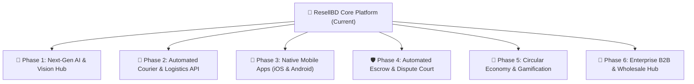

# 🚀 ResellBD — Future Roadmap & Strategic Expansion Plan

> **ResellBD (RecycleHub)** is poised to become Bangladesh’s leading AI-driven circular economy platform. This document outlines the comprehensive **Future Roadmap**, categorized by strategic pillars, technological milestones, and actionable phases.

---

## 🧭 Executive Summary of Future Directions



---

## 📌 Pillar 1: Advanced AI & Computer Vision

### 1.1 Multi-Angle AI Defect & Scratch Severity Analysis
- **Goal**: Allow buyers to see objective wear-and-tear condition scores.
- **Implementation**: Train vision models to detect scratches, screen cracks, dents, and fabric tear on uploaded images, generating an automated **Wear & Tear Rating (1-10)**.

### 1.2 Background Cleanup & Studio Photo Enhancer
- **Goal**: Boost listing conversion rates.
- **Implementation**: Automatically remove messy room backgrounds and replace them with studio-grade neutral white/gradient backdrops using edge AI segmentation.

### 1.3 Real-Time Historical Depreciation Curves
- **Goal**: Price transparency for buyers and sellers.
- **Implementation**: Display interactive price depreciation graphs (e.g., *“This iPhone 13 was ৳65,000 6 months ago, average market resale today is ৳48,000”*).

### 1.4 Bangla & English Voice Search Assistant
- **Goal**: Accessibility for regional and non-tech-savvy users.
- **Implementation**: Voice-to-text search support for Bengali dialects (e.g., *“কম দামে ভালো সাইকেল দেখাও”*).

---

## 🚚 Pillar 2: Logistics & Automated Courier Integration

### 2.1 Nationwide Courier API Integration
- **Goal**: Zero manual courier booking for sellers.
- **Target Partners**: **Steadfast, Pathao Courier, RedX, Paperfly**.
- **Workflow**:
  1. Buyer places order on ResellBD.
  2. One-click **"Request Courier Pickup"** for seller.
  3. Automated Courier Tracking ID & Airway Bill (AWB) generation.
  4. Real-time webhook updates from pickup ➔ hub transit ➔ doorstep delivery.

### 2.2 Live Map Order Tracking
- Embedded real-time delivery map in `/orders` showing parcel location from seller to buyer.

### 2.3 Automated Return Logistics
- 48-hour return window with automated return label generation if item is disputed as defective.

---

## 📱 Pillar 3: Cross-Platform Mobile Applications

### 3.1 React Native / Flutter iOS & Android Apps
- **Goal**: High user retention and push engagement.
- **Key Mobile Features**:
  - Direct camera capture for fast 30-second listing creation.
  - Push notifications for price drops, chat messages, and order status updates via **Firebase Cloud Messaging (FCM)**.
  - Biometric login (Face ID / Fingerprint).

### 3.2 Offline-First PWA Capabilities
- Cached marketplace listings for uninterrupted browsing under unstable 3G/4G connections.

---

## 🛡️ Pillar 4: Smart Escrow & Dispute Resolution Court

### 4.1 Automated 48-Hour Inspection Window
- **Workflow**:
  - Payment is locked in ResellBD Escrow via SSLCommerz.
  - Once courier delivers package, buyer has **48 hours** to test and verify the item.
  - If satisfied, funds are automatically disbursed to the seller’s bank / bKash merchant account.

### 4.2 In-App Video Unboxing & Evidence Portal
- Buyers can upload 15-second unboxing video proof directly within the dispute ticket to prevent fraudulent return claims.

### 4.3 AI-Powered Dispute Arbitration
- Natural Language Processing (NLP) reviews chat logs, listing claims, and unboxing media to recommend fair dispute resolutions to admins.

---

## 🌱 Pillar 5: Circular Economy, Gamification & Community

### 5.1 Carbon Footprint & Eco-Impact Dashboard
- Every second-hand purchase displays **CO2 emissions saved** and **e-waste diverted** from landfills.
- Users earn **Eco Badges** and leaderboards for sustainable shopping.

### 5.2 Direct Item-for-Item Barter / Swap Mode
- Option for users to list items for direct exchange without cash (e.g., *“Trading PS4 games for Nintendo Switch titles”*).

### 5.3 Live Video Bidding & Flash Auctions
- Scheduled 15-minute live stream auctions for rare electronics, vintage items, and luxury fashion.

---

## 💼 Pillar 6: B2B Wholesaler & Refurbished Certified Hub

### 6.1 "ResellBD Certified Refurbished" Program
- Partnership with certified technicians to inspect, repair, and offer **3 to 6 months platform warranty** on laptops and smartphones.

### 6.2 Bulk Inventory & Seller POS Integration
- CSV/Excel bulk product import for commercial second-hand shops.
- Thermal invoice receipt printer integration for brick-and-mortar thrift stores.

### 6.3 Automated WhatsApp & SMS Notification Suite
- Instant WhatsApp updates sent to buyers for OTP, order confirmation, tracking links, and delivery receipts.

---

## ⚡ Pillar 7: Cloud Infrastructure & Scalability

| Category | Planned Upgrade | Objective |
| :--- | :--- | :--- |
| **Caching Layer** | **Redis / Upstash** | Sub-10ms response times for active product queries and session stores. |
| **Image Pipeline** | **Cloudflare Images / Edge WebP** | Convert Google Drive media into modern next-gen WebP/AVIF formats on edge. |
| **Microservices** | **Decoupled Workers** | Separate background workers for email triggers, notifications, AI processing, and analytics. |
| **Monitoring** | **Sentry & Grafana / Prometheus** | Real-time frontend crash reporting, server latency alarms, and APM tracking. |

---

## 🗓️ Phase-by-Phase Execution Roadmap

```
2026 Q3 (Short Term)
 ├── Automated Courier APIs (Steadfast / Pathao integration)
 ├── SMS / WhatsApp milestone alerts
 └── AI Studio photo background remover

2026 Q4 (Mid Term)
 ├── React Native Mobile App Beta (Android & iOS)
 ├── 48-Hour Inspection Escrow automation
 └── Refurbished Certified Seller Badge

2027 Q1-Q2 (Long Term)
 ├── Live Video Auctions & Barter Swap Mode
 ├── Eco-Impact carbon footprint tracking
 └── Regional Expansion across South Asian circular markets
```
