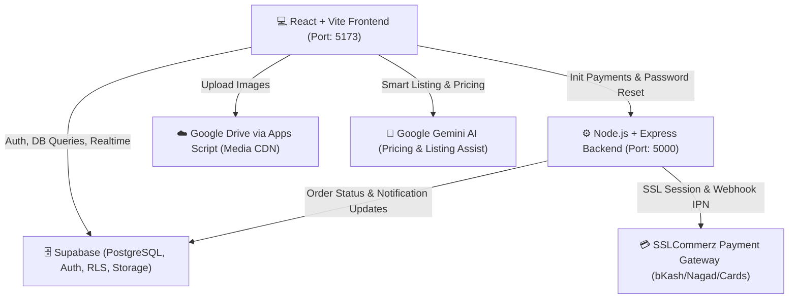

# 📖 ResellBD — Project Working Procedure

> **ResellBD (RecycleHub)** is an AI-powered, trust-verified second-hand e-commerce marketplace in Bangladesh with integrated **SSLCommerz digital payments**, **Google Drive media processing**, and an **Enterprise Super Admin Control Center**.

---

## 🏗️ 1. High-Level System Architecture



---

## 👥 2. User Roles & Permission Levels

| Role | Access URL | Permissions & Capabilities |
| :--- | :--- | :--- |
| **Buyer / Guest** | `/`, `/products`, `/cart`, `/checkout` | Browse listings, filter, chat with sellers, make offers, purchase via SSLCommerz / COD, leave reviews. |
| **Seller** | `/sell/new`, `/my-listings`, `/dashboard` | AI-assisted product listing, manage inventory, negotiate offers, fulfill orders, upgrade subscription plans. |
| **Admin** | `/admin` | Manage users, approve/reject products, review KYC identity verifications, handle reports, track orders. |
| **Super Admin** | `/superadmin` (Secure God Mode) | Platform health & metrics, RBAC roles, database status, system settings, homepage builder, banners, SEO, CRM. |

---

## 🔄 3. End-to-End Working Procedure (Step-by-Step)

### 🔹 Procedure 1: User Onboarding & Identity Verification (KYC)
1. **Registration & Auth**: Users register via `/signup` using email & password or social auth (powered by Supabase Auth).
2. **Profile & Trust Score**: Each user receives a dynamic **Trust Score (0-100)** calculated based on transaction history, response speed, and verification levels.
3. **Identity Verification (`/kyc`)**:
   - User uploads Government NID / Trade License image.
   - Admin reviews and approves the submission in `/admin/identity-verifications`.
   - Verified sellers receive a green **Verified Seller Badge** on all their listings.

---

### 🔹 Procedure 2: Product Listing & AI Intelligence (`/sell/new`)
1. **Media Upload**:
   - Seller uploads product images.
   - Images are processed and uploaded to **Google Drive** via Google Apps Script and transformed to fast CDN direct links (`lh3.googleusercontent.com/d/{id}`).
2. **AI Vision & Description Assistant**:
   - AI automatically evaluates product category and condition (New / Excellent / Good / Fair / Poor).
   - Generates bullet-pointed technical specifications and persuasive descriptions in 1 click.
3. **AI Price Intelligence & Anti-Counterfeit Detector**:
   - Compares fair market valuation against current resale demand.
   - Evaluates listing risk score to prevent counterfeit or spam items.
4. **Publish**: Seller publishes listing (Status: `pending` or `active`).

---

### 🔹 Procedure 3: Buyer Discovery & In-App Bargaining
1. **Marketplace Discovery (`/products`)**:
   - Fast full-text search, division/district location filters, condition filters, and price sliders.
   - Listings show **Deal Score Badges** (e.g., *Great Deal: Save ৳150*).
2. **In-App Messaging & Safe Meetup (`/messages`)**:
   - Buyers can chat with sellers in real time.
   - **Make Offer**: Buyer can submit a bargaining price offer; seller can Accept or Counter.
   - **Safe Meetup Scheduler**: Recommends public verified safe meetup zones across Bangladeshi cities.

---

### 🔹 Procedure 4: Cart, Checkout & SSLCommerz Payment Gateway (`/checkout`)
1. **Cart Management (`/cart`)**:
   - Buyers can adjust quantities, apply coupons, or move items between Cart and Wishlist.
2. **Multi-Step Checkout**:
   - **Step 0 (Address)**: Select saved address or add new with Division/District selector.
   - **Step 1 (Delivery)**: Standard Courier Delivery (৳120) or Store Pickup (Free).
   - **Step 2 (Payment Provider)**:
     - 🌟 **SSLCommerz Digital Gateway (RECOMMENDED)**: Instant payment via **bKash, Nagad, Rocket, Upay, Visa, Mastercard, AMEX, or Net Banking**.
     - 📦 **Cash on Delivery (COD)**: Pay upon courier delivery.
   - **Step 3 (Review & Confirm)**.
3. **SSLCommerz Payment Execution**:
   - Frontend calls backend `POST /api/sslcommerz/init`.
   - Backend initializes SSLCommerz session with unique `tran_id` and returns `GatewayPageURL`.
   - Buyer is redirected to SSLCommerz to complete OTP / card authentication.
   - SSLCommerz redirects to backend `POST /api/sslcommerz/success`.
   - Backend validates the transaction via SSL Validation Server API, updates order status to `paid` and `confirmed`, clears cart, sends notifications, and redirects buyer to `/payment/success` with downloadable digital invoice.

---

### 🔹 Procedure 5: Seller Monetization & Subscriptions (`/pricing`)
1. Sellers choose subscription tiers (Free, Basic, Professional, Business, Enterprise) on monthly or yearly cycles.
2. Paid upgrades launch SSLCommerz gateway session for seller payments.
3. Upon payment confirmation, subscription privileges (unlimited listings, featured placements, analytics) activate automatically.

---

### 🔹 Procedure 6: Platform Moderation & Super Admin Control Center (`/superadmin`)
- **Product Moderation**: Inspect flagged listings, approve or ban violating products.
- **Role-Based Access Control (RBAC)**: Assign roles (`super_admin`, `admin`, `moderator`, `support`).
- **Homepage & CMS Builder**: Update landing page hero banners, featured categories, announcements, and blogs.
- **Analytics & Platform Health**: Monitor GMV, active users, database connections, and revenue metrics.

---

## 🛠️ 4. Quick Run & Maintenance Commands

### 1. Start Frontend Server
```bash
# In project root
npm run dev
# App runs at: http://localhost:5173
```

### 2. Start Backend API Server (Required for SSLCommerz & Password Resets)
```bash
# In server directory
cd server
node index.js
# Backend runs at: http://localhost:5000
```

### 3. Verify Production Build
```bash
npm run build
```

---

## 🔒 5. Key Security & Compliance Standards
- **256-bit SSL Encryption**: All digital payment payloads processed through SSLCommerz sandbox / live servers.
- **Row Level Security (RLS)**: Database tables secured so users can only modify their own listings, orders, and messages.
- **Escrow Buyer Guarantee**: Payment is held safely until buyer confirms receipt of genuine second-hand items.
