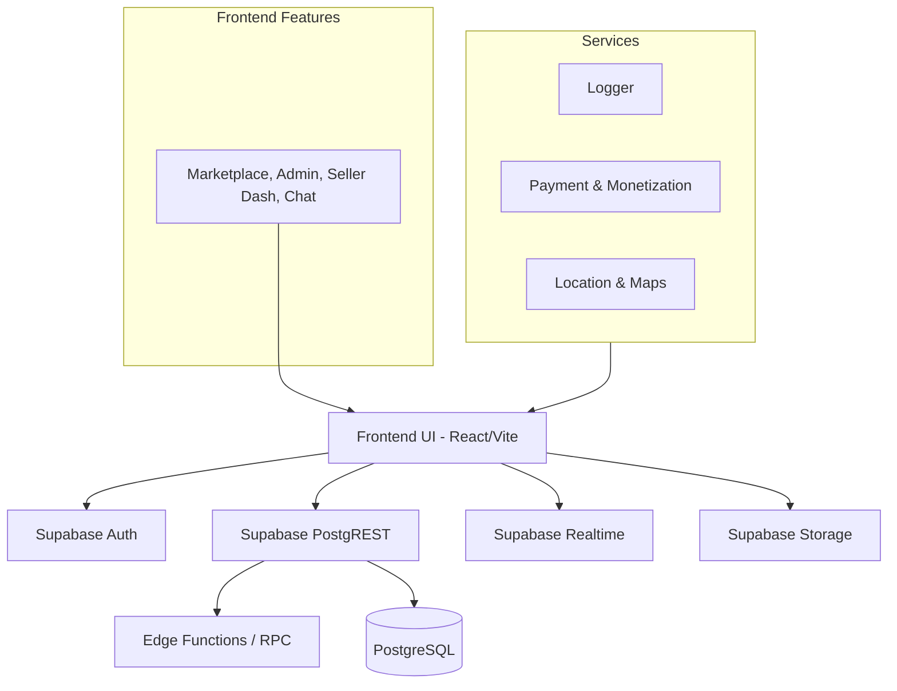

# RecycleHub Developer Guide

Welcome to the RecycleHub engineering team! This guide will help you understand the architecture, setup process, and contribution standards.

## Architecture Diagram

## Folder Structure

Our architecture utilizes a feature-sliced design to maximize scalability:

- `src/features/`: Isolated feature modules (e.g., `admin`, `auth`, `chat`, `delivery`, `payments`, `maps`). Each feature contains its own `components`, `hooks`, `services`, and `types`.
- `src/components/`: Globally shared UI elements (Button, Input, Modal).
- `src/pages/`: Route-level entry points. These are generally thin wrappers that orchestrate feature components.
- `src/lib/`: Core utilities (Supabase client, Logger, Analytics, Security).
- `supabase/migrations/`: The definitive source of truth for our PostgreSQL schema and optimizations.

## Setup Guide

1. **Install Node.js 20+**.
2. Run `npm install` in the root directory.
3. Copy `.env.example` to `.env` and fill in `VITE_SUPABASE_URL` and `VITE_SUPABASE_ANON_KEY`.
4. Run `npm run dev` to start the Vite development server on `localhost:5173`.

## Coding Standards

- **TypeScript:** Strict mode is enabled. Use explicit interfaces for props and API responses. Avoid `any`.
- **Styling:** We use Tailwind CSS. Prefer utility classes over custom CSS. Use `tailwind-merge` for dynamic classes.
- **State Management:** Use `@tanstack/react-query` for server state. React Context is reserved for global app state (Auth, Theme).
- **Icons:** We use `lucide-react`.

## Contribution Guide

1. Branch off `main` with a descriptive name (e.g., `feature/ai-pricing`, `fix/chat-scroll`).
2. Ensure `npm run lint` and `npm run typecheck` pass.
3. Write unit tests for new services in `vitest`.
4. Submit a Pull Request. CI will automatically run tests and generate a preview deployment.
